## Introduction

This vignette contains all of the code necessary for the microbiome analysis within our paper named "". In this study, we researched the relationship between Covid-19 and the gut microbiome as well as connections to mental health. The gut microbiome analysis of this study was performed through long-read 16S sequencing we performed within our lab at Houston Methodist Research Institute and raw fastq data can be found at BioProject #___.

Much of the data and visualizations here had slight visual touching up in photoshop/coreldraw just to make them look _perf_ prior to submission, so if you see a difference between the figures produced here and those found within our paper that is why.

In the beginning of this markdown, we will perform all the steps needed to process long-read 16S data from [Emu](https://github.com/treangenlab/emu) including conversion to a phyloseq object.

```{r, code_folding=TRUE}
library(dplyr)
library(stringr)
library(magrittr)
library(tidyr)
library(igraph)
library(visNetwork)
library(biomformat)
library(ggplot2)
library(ggprism)
library(ggsci)
library(ggside)
library(forcats)
library(FSA)
library(ggsignif)
library(broom)
library(ggsci)
library(DT)
library(tibble)
library(ape)
library(phytools)
library(microbiome)
library(SpiecEasi)
library(microViz)
library(patchwork)
library(parallel)
library(foreach)
library(reticulate)
```

## Loading in data into a phyloseq object

The data used in this were from Covid-19 patients of varying age and severity to which we appreciate their help with this work profoundly. This data can be found at [covid_biome](https://github.com/villapollab/covid_biome/data).

```{r}
# Lets make a gigantic metadata file joining by DNI
meta1 = read.csv("data/metadata_124.csv", check.names = FALSE)

# metadata file 2
meta2 = read.delim("data/metadata_all_PACS.tsv", check.names = FALSE) |>
  dplyr::select(sample, Time, COVID19, COVID19_severity, BMI, DNI, 
                Treatment, Age, Old, Sex, Antibiotic, remove_duplicate) |>
  dplyr::mutate_all(~replace(., is.na(.), 0))

# Filter and make it easier for english speakers
meta = left_join(meta2, meta1, by = "DNI") |>
  dplyr::filter(COVID19 == "COVID" & Time == "T0")|>
  dplyr::mutate_all(~replace(., is.na(.), 0)) |>
  dplyr::filter(ID > 0) |>
  dplyr::filter(remove_duplicate == "") |>
  dplyr::mutate_all(~ifelse(. == "no", 0, .)) |>
  dplyr::mutate_all(~ifelse(. == "si", 1, .)) |>
  tibble::column_to_rownames("sample")

# Load and prepare taxonomy file
tax_file <- read.delim("data/emu-combined-taxonomy-species.tsv") |>
  dplyr::select(superkingdom, phylum, class, order, family, genus, species) |>
  as.matrix()

# Ensure all elements in tax_file are characters
tax_file <- apply(tax_file, 2, as.character)

# Load in Emu results
emu <- read.delim(file = "data/emu-combined-abundance-species-counts.tsv", check.names = FALSE) |>
  mutate_all(~replace(., is.na(.), 0)) |>
  column_to_rownames("species")

# Filter out columns ending with "-threshold-0.0001"
filt_cols <- grep("-threshold-0.0001$", names(emu), value = TRUE, ignore.case = TRUE)
filt_emu <- emu[, !(names(emu) %in% filt_cols)]

# Convert to matrix and ensure numeric type for otu_table
emu_otu_mat <- as.matrix(filt_emu)
emu_otu_mat <- apply(emu_otu_mat, 2, as.numeric)

# Create the OTU, sample data, and taxonomy table objects
emu_otu <- otu_table(emu_otu_mat, taxa_are_rows = TRUE)
emu_sam <- sample_data(meta)
emu_tax <- tax_table(as.matrix(tax_file))

# Combine into a phyloseq object
physeq <- phyloseq(emu_otu, emu_sam, emu_tax)
```

Now that we've combined our data into a phyloseq object we want to add the tree to this phyloseq object too. To do this we must make sure we used the Emu 16S database, then we will create the reference tree using the script found here [emu_db_tree](https://osf.io/rqcs2) and the nodes.dmp and names.dmp from the same Emu database OSF. Once made we will use a couple more python scripts to filter the leaves of the tree by the taxa we have present within our current phyloseq object.

```{r, code_folding=TRUE, eval=FALSE}
#Take OTU table to make map for tree
tax_table_physeq <- tax_table(physeq)

# Convert the OTU table to a data frame
tax_table_df <- as.data.frame(tax_table_physeq) |>
  rownames_to_column()
tax_table_df <- tax_table_df |> rename(emOTU = 1) |> select(emOTU, species)

# read in emu database taxonomy.tsv (change path accordingly)
taxid = read.delim("/condo/neurobiome/tmhagm8/emu/emu_database/taxonomy.tsv", 
                   header = TRUE, check.names = FALSE) |>
  select(tax_id, species)

tax_map = left_join(taxid, tax_table_df, by = "species") |>
  select(tax_id, emOTU) |>
  filter(emOTU != "")

write.csv(tax_map, file = "data/taxid_2_OTU.csv", row.names = FALSE)

```

## Making the phylogenetic tree

Lets make the reference tree first, this chunk will run a python script in R using the library [reticulate](https://rstudio.github.io/reticulate/). You will be asked to make a venv (named emOTU) for the reticulate package to which you should.

```{r, echo=FALSE, results='hide', code_folding=TRUE, eval = FALSE}
# Specify the name of the virtual environment
venv_name <- "emOTU"

# Create the virtual environment if it doesn't exist
if (!virtualenv_exists(venv_name)) {
  virtualenv_create(envname = venv_name)
}

# Install the necessary Python packages in the virtual environment
virtualenv_install(envname = venv_name, packages = c("pandas", "scikit-bio", "ete3", "biom-format"))

# Use the virtual environment
use_virtualenv(venv_name, required = TRUE)

# Define the paths
script_path <- "scripts/agm_tree.py"
taxdump_dir <- "taxdump_dir"
output_file <- "data/emu_ref_tree.nwk"

# Get the Python executable path from the virtual environment
python_path <- virtualenv_python(envname = venv_name)

# Execute the script using system2()
result <- system2(python_path, args = c(script_path, taxdump_dir, output_file), stdout = TRUE, stderr = TRUE)

```

Next, we have to use the map csv file we made and the reference tree from the previous code chunk to filter our leaves found within the map csv file.

```{r, echo=FALSE, results='hide', code_folding=TRUE, eval = FALSE}
# Specify the name of the virtual environment
venv_name <- "emOTU"

# Create the virtual environment if it doesn't exist
if (!virtualenv_exists(venv_name)) {
  virtualenv_create(envname = venv_name)
}

# Use the virtual environment
use_virtualenv(venv_name, required = TRUE)

# Define the paths
script_path <- "scripts/agmtrialtree.py"
input_tree_file <- "data/emu_ref_tree.nwk"
input_map_file <- "data/taxid_2_OTU.csv"
output_tree_file <- "data/physeq_tree.nwk"

# Get the Python executable path from the virtual environment
python_path <- virtualenv_python(envname = venv_name)

# Execute the script using system2()
result2 <- system2(python_path, args = c(script_path, input_tree_file, input_map_file, output_tree_file), 
                   stdout = TRUE, stderr = TRUE)
```

{style="width: 100%"}

If you want to learn more about how I made this with the proper names simply show the code below.

```{r, eval=FALSE, code_folding=TRUE}
species_tree <- read.tree("data/physeq_tree.nwk")

map <- read.csv("data/otu_2_species.csv", header = T, check.names = F, row.names = 1)

otu_to_species <- map %>%
  select(rowname, species) %>%
  deframe()  # This will create a named vector: OTUs as names, species as values

species_tree$tip.label <- otu_to_species[species_tree$tip.label]

write.tree(species_tree, file = "species_tree.newick")

plot_tree(species_tree, label.tips = "rowname", )
```

Now we have our trimmed down tree for us to merge with our phyloseq object.

```{r, code_folding=TRUE, echo=FALSE}
unroot_tree = read.tree("data/physeq_tree.nwk")
tree <- ape::root(unroot_tree, outgroup = "sp651", resolve.root = TRUE)
is.rooted(tree)

# And add it to our phyloseq object
physeq <- merge_phyloseq(physeq, phy_tree(tree))
```

## Touching up the phyloseq object

We end this section by adjusting this phyloseq object using the MicroViz package functions. If there is any code that will need adjusting it will most likely be this part.

```{r}
# Remove ASVs that break dis
pop_taxa = function(physeq, badTaxa){
  allTaxa = taxa_names(physeq)
  allTaxa <- allTaxa[!(allTaxa %in% badTaxa)]
  return(prune_taxa(allTaxa, physeq))
}

# ASVs that are no bueno
badTaxa = c("sp1692")

# Cleaned up physeq for ancombc
ps = pop_taxa(physeq, badTaxa)

covid <- phyloseq_validate(ps) |>
  tax_fix() 

# round otu counts
round_covid = round(otu_table(covid))

# Update sample_data in phyloseq object
bigvid <- phyloseq(round_covid, covid@tax_table, covid@sam_data)
vid <- merge_phyloseq(bigvid, phy_tree(tree))
```

## Using our phyloseq object to analyze and visualize the data

Up to this point our work is solid, from here on out I want us to write some code chunks we can use for all 16S analyses. I would like to implement [MicroViz](https://github.com/david-barnett/microViz) for clr relative abundance and ordination plotting,richness estimation, [ANCOMBC2](https://github.com/FrederickHuangLin/ANCOMBC) for differential abundance, and [spiec-easi](https://github.com/zdk123/SpiecEasi) for network analysis.

__For all microbiome analyses__
How to pick a threshold? --> Depends on what analysis method you are filtering for!

* Alpha diversity = DO NOT FILTER
* Beta diversity = relevance of threshold depends on your distance measure
* Differential abundance testing = stringent filtering, prevalence >5%, >10%?

If you're unsure, check out the [MicroViz documentation](https://david-barnett.github.io/microViz/) or read some Amy Willis' [statdivlab](https://github.com/statdivlab) papers!

## Alpha Diversity
The following code chunks will generate Shannon and Simpson diversity, as well as Chao1 richness plots, based on COVID severity levels (or any other covariate of your choice). The code will also assess significant differences between covariate values using the Kruskal-Wallis test followed by Dunn’s post-hoc test.

__Shannon Diversity Calculation and Visualization__

```{r, code_folding=FALSE, eval=FALSE, warning=FALSE}
# Calculate Shannon
shan_data <- vid |>
  ps_calc_diversity(rank = "species", index = "shannon") |>
  samdat_tbl()

# Write severity in order
vid@sam_data$PHQ_Covid_Severity <- factor(vid@sam_data$PHQ_Covid_Severity, 
                                           levels = c("low", "moderate", "critical"))

# Ensure PHQ_Covid_Severity is a factor and get its levels
shan_data$PHQ_Covid_Severity <- factor(shan_data$PHQ_Covid_Severity, 
                                       levels = c("low", "moderate", "critical"))
severity_levels <- levels(shan_data$PHQ_Covid_Severity)

# Perform Kruskal-Wallis test
kruskal_result <- kruskal.test(shannon_species ~ PHQ_Covid_Severity, data = shan_data)

# Perform post-hoc pairwise comparisons (Dunn's test)
posthoc_result <- dunnTest(shannon_species ~ PHQ_Covid_Severity, data = shan_data, method = "holm")

# Extract p-values from post-hoc comparisons
shan_p_adjusted <- posthoc_result$res$P.adj

# Create significance labels
sig_labels <- sapply(shan_p_adjusted, function(p) {
  if(p > 0.05) return("ns")
  if(p <= 0.05 & p > 0.01) return("*")
  if(p <= 0.01 & p > 0.001) return("**")
  if(p <= 0.001) return("***")
})

# Create all comparisons for plotting
comparisons <- combn(severity_levels, 2, simplify = FALSE)

# Create the plot
ggplot(shan_data, aes(y = PHQ_Covid_Severity, x = shannon_species, fill = PHQ_Covid_Severity)) +
  geom_boxplot(width = 0.3) +
  geom_point(position = position_jitter(height = 0.2), alpha = 1, color = "black") +
  scale_fill_npg() +
  theme_prism() +
  coord_flip() +
  theme(legend.position = "none") +
  geom_signif(
    comparisons = comparisons,
    map_signif_level = TRUE,
    annotations = sig_labels,
    y_position = seq(max(shan_data$shannon_species) * 1.05, 
                     by = 0.1, 
                     length.out = length(comparisons))
  ) +
  labs(x = "Shannon Diversity (Species)", y = "Covid Severity")

ggsave("assets/img/covid_PHQ_shannon_kruskal.png", height = 7, width = 5, units = "in")

```

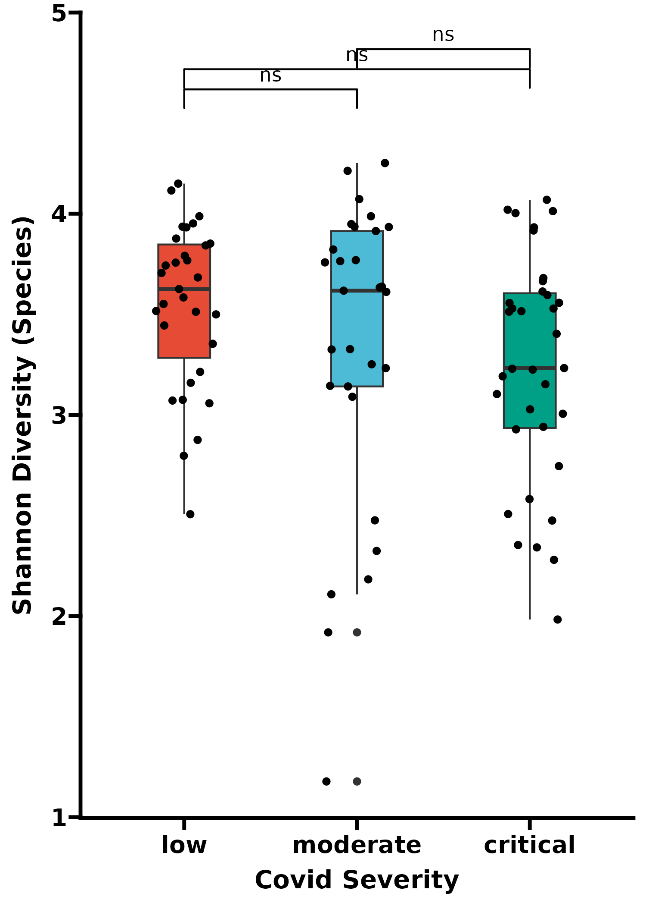

__Simpson Diversity Calculation and Visualization__

```{r, code_folding=TRUE, eval=FALSE}
# Calculate Simpson diversity (Gini-Simpson index)
simp_data <- vid |>
  ps_calc_diversity(rank = "species", index = "gini_simpson") |>
  samdat_tbl()

# Ensure PHQ_Covid_Severity is a factor and set the levels in the correct order
simp_data$PHQ_Covid_Severity <- factor(simp_data$PHQ_Covid_Severity, 
                                       levels = c("low", "moderate", "critical"))
severity_levels <- levels(simp_data$PHQ_Covid_Severity)

# Perform Kruskal-Wallis test for overall comparison
kruskal_result <- kruskal.test(gini_simpson_species ~ PHQ_Covid_Severity, data = simp_data)

# Perform post-hoc pairwise comparisons (Dunn's test) 
posthoc_result <- dunnTest(gini_simpson_species ~ PHQ_Covid_Severity, data = simp_data, method = "holm")

# Extract p-values from post-hoc comparisons
simp_p_adjusted <- posthoc_result$res$P.adj

# Create significance labels
sig_labels <- sapply(simp_p_adjusted, function(p) {
  if(p > 0.05) return("ns")
  if(p <= 0.05 & p > 0.01) return("*")
  if(p <= 0.01 & p > 0.001) return("**")
  if(p <= 0.001) return("***")
})

# Create all comparisons for plotting
comparisons <- combn(severity_levels, 2, simplify = FALSE)

# Create the plot for Simpson diversity
ggplot(simp_data, aes(y = PHQ_Covid_Severity, x = gini_simpson_species, fill = PHQ_Covid_Severity)) +
  geom_boxplot(width = 0.3) +
  geom_point(position = position_jitter(height = 0.2), alpha = 1, color = "black") +
  scale_fill_npg() +
  theme_prism() +
  coord_flip() +
  theme(legend.position = "none") +
  geom_signif(
    comparisons = comparisons,
    map_signif_level = TRUE,
    annotations = sig_labels,
    y_position = seq(max(simp_data$gini_simpson_species) * 1.05, 
                     by = 0.1, 
                     length.out = length(comparisons))
  ) +
  labs(x = "Simpson Diversity (Species)", y = "Covid Severity")

# Save the plot
ggsave("assets/img/covid_PHQ_simpson_kruskal.png", height = 7, width = 5, units = "in")

```

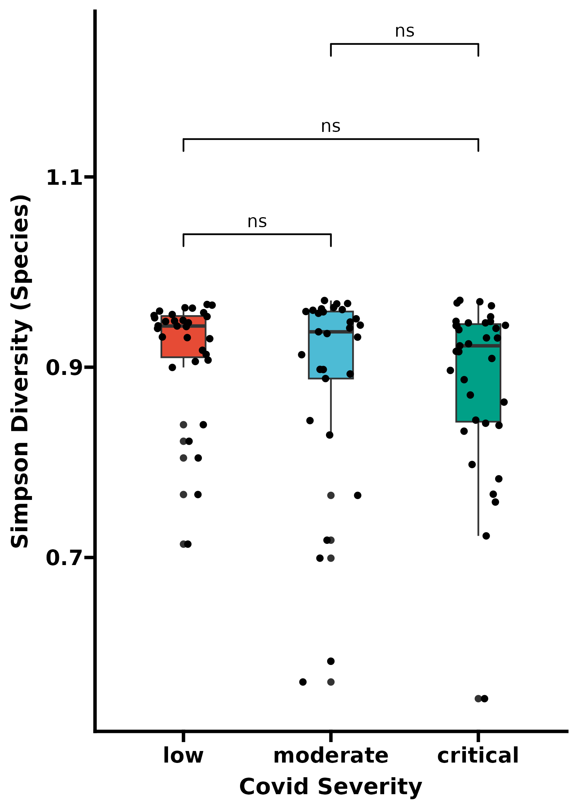

__Chao1 Richness Calculation and Visualization__

```{r, code_folding=TRUE, eval=FALSE}
# Calculate Chao1 richness
chao1_data <- vid |>
  ps_calc_richness(rank = "species", index = "chao1") |>
  samdat_tbl()

# Ensure PHQ_Covid_Severity is a factor and set the levels in the correct order
chao1_data$PHQ_Covid_Severity <- factor(chao1_data$PHQ_Covid_Severity, 
                                       levels = c("low", "moderate", "critical"))
severity_levels <- levels(chao1_data$PHQ_Covid_Severity)

# Perform Kruskal-Wallis test for overall comparison
kruskal_result <- kruskal.test(chao1_species ~ PHQ_Covid_Severity, data = chao1_data)

# Perform post-hoc pairwise comparisons (Dunn's test)
posthoc_result <- dunnTest(chao1_species ~ PHQ_Covid_Severity, data = chao1_data, method = "holm")

# Extract p-values from post-hoc comparisons
chao1_p_adjusted <- posthoc_result$res$P.adj

# Create significance labels
sig_labels <- sapply(chao1_p_adjusted, function(p) {
  if(p > 0.05) return("ns")
  if(p <= 0.05 & p > 0.01) return("*")
  if(p <= 0.01 & p > 0.001) return("**")
  if(p <= 0.001) return("***")
})

# Create all comparisons for plotting
comparisons <- combn(severity_levels, 2, simplify = FALSE)

# Create the plot for Chao1 richness
ggplot(chao1_data, aes(y = PHQ_Covid_Severity, x = chao1_species, fill = PHQ_Covid_Severity)) +
  geom_boxplot(width = 0.3) +
  geom_point(position = position_jitter(height = 0.2), alpha = 1, color = "black") +
  scale_fill_npg() +
  theme_prism() +
  coord_flip() +
  theme(legend.position = "none") +
  geom_signif(
    comparisons = comparisons,
    map_signif_level = TRUE,
    annotations = sig_labels,
    y_position = seq(max(chao1_data$chao1_species) * 1.05, 
                     by = 0.1, 
                     length.out = length(comparisons))
  ) +
  labs(x = "Chao1 Richness (Species)", y = "Covid Severity")

# Save the plot
ggsave("assets/img/covid_PHQ_chao1_kruskal.png", height = 7, width = 5, units = "in")

```

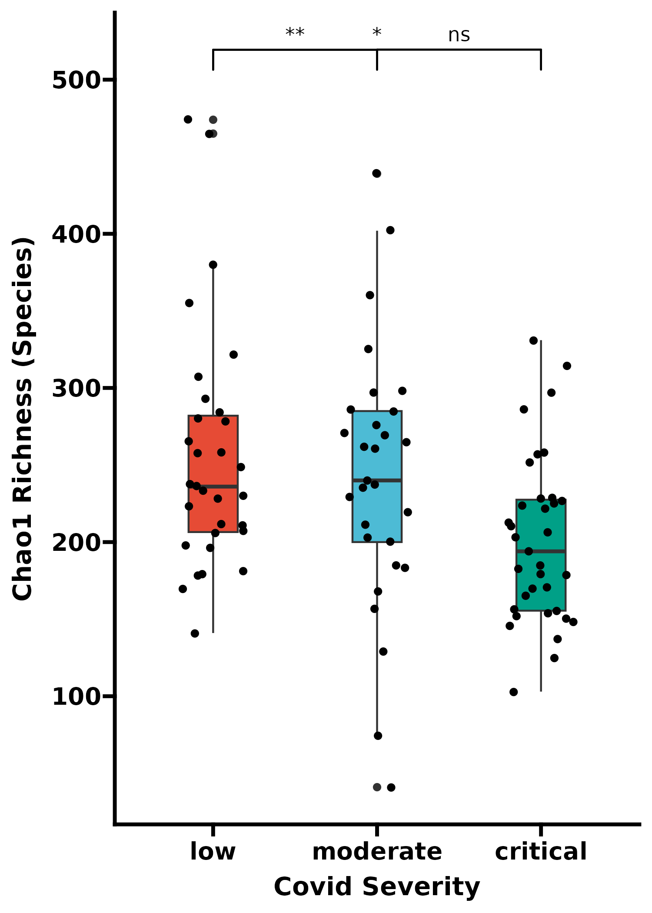

## Beta diversity

I really like MicroViz and use it for these analyses. If you want to explore your data and have it within a phyloseq object you can use their ord_explore() function.

This next chunk is to understand where your data should be filtered at and helps to visualize what it looks like.

```{r, eval = FALSE, code_folding=TRUE, warning=FALSE}
# gotta start of with read filtering
vid |>
  ps_mutate(reads = sample_sums(vid)) |> #this will get you read depth!
  samdat_tbl() |>
  ggplot(aes(x = reads)) +
  geom_freqpoly(bins = 100) +
  geom_rug(alpha = 0.5) +
  scale_x_log10(labels = scales::label_number()) +
  labs(x = "Number of classified reads", y = NULL) +
  theme_bw()

# lets find where we should filter our data
vidStats <- tibble(
  taxon = taxa_names(vid),
  prevalence = microbiome::prevalence(vid),
  total_abundance = taxa_sums(vid)
)

# plot 
p <- vidStats |>
  ggplot(aes(total_abundance, prevalence)) +
  geom_point(alpha = 0.5) +
  geom_rug(alpha = 0.1) +
  scale_x_continuous(
    labels = scales::label_number(), name = "Total Abundance"
  ) +
  scale_y_continuous(
    labels = scales::label_percent(), breaks = scales::breaks_pretty(n = 9),
    name = "Prevalence (%)",
    sec.axis = sec_axis(
      trans = ~ . * nsamples(vid), breaks = scales::breaks_pretty(n = 9),
      name = "Prevalence (N samples)"
    )
  ) +
  theme_bw()

# and add the taxa labels 
p + ggrepel::geom_text_repel(
  data = function(df) filter(df, total_abundance > 1e9 | prevalence > 0.6),
  mapping = aes(label = taxon), size = 2.5, min.segment.length = 0, force = 15
)

# vidStats |>
#   ggplot(aes(x = total_abundance, y = prevalence)) +
#   geom_vline(xintercept = 10000, color = "red", linetype = "dotted") +
#   geom_hline(yintercept = 2 / 100, color = "red", linetype = "dotted") +
#   geom_point(alpha = 0.5) +
#   geom_rug(alpha = 0.1) +
#   scale_x_log10(labels = scales::label_number(), name = "Total Abundance") +
#   scale_y_log10(
#     labels = scales::label_percent(), breaks = scales::breaks_log(n = 9),
#     name = "Prevalence (%)",
#     sec.axis = sec_axis(
#       trans = ~ . * nsamples(shao19), breaks = scales::breaks_log(n = 9),
#       name = "Prevalence (N samples)"
#     )
#   ) +
#   theme_bw()

# this make a plot which does not visualize well but if you blow it up can show per sample variations.
# vid |>
#   tax_table() |>
#   as.data.frame() |>
#   as_tibble(rownames = "taxon") |>
#   left_join(vidStats, by = "taxon") |>
#   add_count(genus, name = "genus_count", sort = TRUE) |>
#   mutate(phylum = factor(genus, levels = unique(genus))) |> # to fix facet order
#   mutate(phylum = forcats::fct_lump_n(genus, n = 15)) |>
#   mutate(phylum = forcats::fct_explicit_na(genus, na_level = "Other")) |>
#   ggplot(aes(total_abundance, prevalence)) +
#   geom_vline(xintercept = 10000, color = "red", linetype = "dotted") +
#   geom_hline(yintercept = 2 / 100, color = "red", linetype = "dotted") +
#   geom_point(alpha = 0.5, size = 1) +
#   geom_rug(alpha = 0.2) +
#   scale_x_log10(
#     labels = scales::label_log(), breaks = scales::breaks_log(n = 5),
#     name = "Total Abundance"
#   ) +
#   scale_y_log10(
#     labels = scales::label_percent(), breaks = scales::breaks_log(n = 9),
#     name = "Prevalence (%)",
#     sec.axis = sec_axis(
#       trans = ~ . * nsamples(vid), breaks = scales::breaks_log(n = 9),
#       name = "Prevalence (N samples)"
#     )
#   ) +
#   facet_wrap("genus") +
#   theme_bw(10)

# from this analysis we can see that a 2% prevalence filter with a 50 reads abundance filter (only bc full length) would suffice
ggsave("assets/img/covid_otu_abund_prev.png", width = 7, height = 5, units = "in")

# these params were chosen as a compromise with Amy Willis' advice (STAMPS 2024)
```

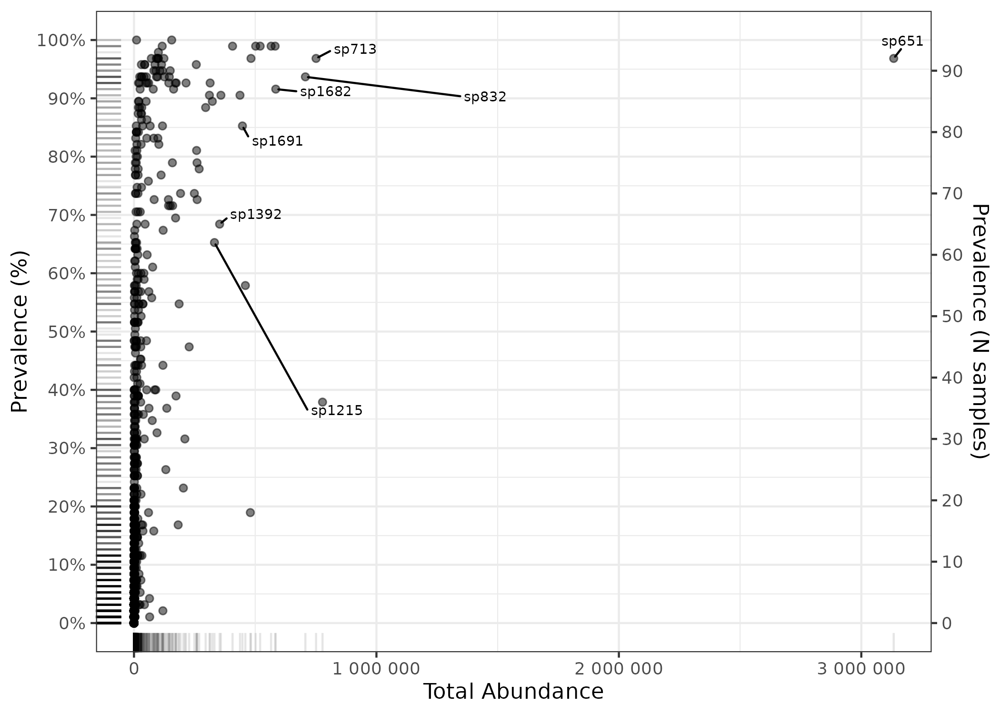

Subset for differences in BMI and plot using Aitchison distance PCoA

```{r, eval=FALSE}
vid_low_bmi = subset_samples(vid, PHQ_Covid_Severity == "low" & BMI == "Lean" | BMI == "Obese")
vid_mod_bmi = subset_samples(vid, PHQ_Covid_Severity == "moderate" & BMI == "Lean" | BMI == "Obese")
vid_crit_bmi = subset_samples(vid, PHQ_Covid_Severity == "critical" & BMI == "Lean" | BMI == "Obese")

vid_low_bmi |>
  tax_filter(min_prevalence = 2 / 100, verbose = FALSE, min_total_abundance = 50) |>
  tax_transform(trans = "compositional", rank = "species") |>
  dist_calc(dist = "aitchison") |>
  ord_calc("PCoA") |>
  ord_plot(color = "BMI", size = 4) +
  scale_color_aaas(aesthetics = c("fill", "colour"), name = "BMI") +
  theme_prism() +
  ggtitle("BMI and COVID low severity") +
  ggside::geom_xsidedensity(aes(fill = BMI), alpha = 0.5, show.legend = FALSE) +
  ggside::geom_ysidedensity(aes(fill = BMI), alpha = 0.5, show.legend = FALSE) +
  ggside::theme_ggside_void() +
  theme(
    axis.title.x = element_text(size = 14),
    axis.title.y = element_text(size = 14),
    axis.text.x = element_text(size = 14),
    axis.text.y = element_text(size = 14),
    plot.title = element_text(size = 14)
  )

ggsave("assets/img/covid_low_bmi_aitch.png", height = 5, width = 7, units = "in")

# recompute distance for permanova --> gotta be a better way
# bmi_dists <- vid_low_bmi |>
#   tax_filter(min_prevalence = 2 / 100, verbose = FALSE, min_total_abundance = 50) |>
#   tax_transform(trans = "compositional", rank = "species") |>
#   dist_calc("aitchison")
# 
# # the more permutations you request, the longer it takes
# # but also the more stable and precise your p-values become
# bmi_perm <- bmi_dists |>
#   dist_permanova(
#     seed = 1234, # for set.seed to ensure reproducibility of random process
#     n_processes = 1, n_perms = 999, # you should use at least 999!
#     variables = "BMI"
#   )
# 
# # view the permanova results
# bmi_permdf = perm_get(bmi_perm) |> as.data.frame()
# write.table(bmi_permdf, file = "final_covid_plots/covid_low_bmi_aitch_pcoa_permanova.tsv", sep = "\t")

```

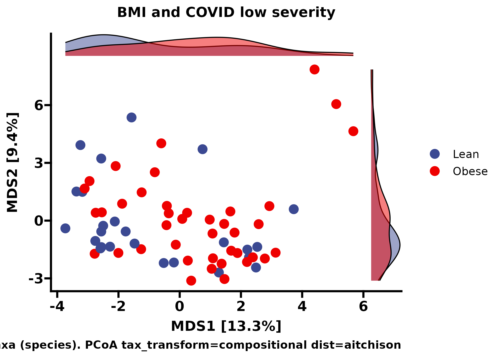

The same style of plot but observing gender differences

```{r, code_folding=TRUE, eval=FALSE}

vid_low_sex = subset_samples(vid, PHQ_Covid_Severity == "low")
vid_mod_sex = subset_samples(vid, PHQ_Covid_Severity == "moderate")
vid_crit_sex = subset_samples(vid, PHQ_Covid_Severity == "critical")

vid_low_sex |>
  tax_filter(min_prevalence = 2 / 100, verbose = FALSE, min_total_abundance = 50) |>
  tax_transform(trans = "compositional", rank = "species") |>
  dist_calc(dist = "aitchison") |>
  ord_calc("PCoA") |>
  ord_plot(color = "Sex", size = 4) +
  scale_color_aaas(aesthetics = c("fill", "colour"), name = "Sex") +
  theme_prism() +
  ggtitle("Gender and COVID low severity") +
  ggside::geom_xsidedensity(aes(fill = Sex), alpha = 0.5, show.legend = FALSE) +
  ggside::geom_ysidedensity(aes(fill = Sex), alpha = 0.5, show.legend = FALSE) +
  ggside::theme_ggside_void() +
  theme(
    axis.title.x = element_text(size = 14),
    axis.title.y = element_text(size = 14),
    axis.text.x = element_text(size = 14),
    axis.text.y = element_text(size = 14),
    plot.title = element_text(size = 14)
  )

ggsave("assets/img/covid_low_sex_aitch.png", height = 5, width = 7, units = "in")

# recompute distance for permanova --> gotta be a better way
# sex_dists <- vid_low_sex |>
#   tax_filter(min_prevalence = 2 / 100, verbose = FALSE, min_total_abundance = 50) |>
#   tax_transform(trans = "compositional", rank = "species") |>
#   dist_calc("aitchison")
# 
# # the more permutations you request, the longer it takes
# # but also the more stable and precise your p-values become
# sex_perm <- sex_dists |>
#   dist_permanova(
#     seed = 1234, # for set.seed to ensure reproducibility of random process
#     n_processes = 1, n_perms = 999, # you should use at least 999!
#     variables = "Sex"
#   )
# 
# # view the permanova results
# sex_permdf = perm_get(sex_perm) |> as.data.frame()
# write.table(sex_permdf, file = "final_covid_plots/covid_low_sex_aitch_pcoa_permanova.tsv", sep = "\t")
```

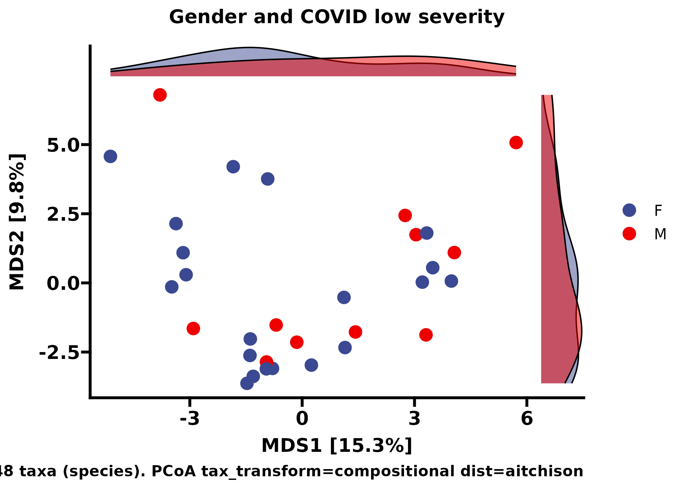

And for the age of the individuals, we chose to filer by less than 60 or greater than or equal to 60.

```{r, code_folding=TRUE, eval=FALSE}
# low, mod, and crit refer to their COVID severity not their age

vid_low_age = subset_samples(vid, PHQ_Covid_Severity == "low" & Old == "y" | Old == "n")
vid_mod_age = subset_samples(vid, PHQ_Covid_Severity == "moderate" & Old == "y" | Old == "n")
vid_crit_age = subset_samples(vid, PHQ_Covid_Severity == "critical" & Old == "y" | Old == "n")

vid_low_age |>
  tax_filter(min_prevalence = 2 / 100, verbose = FALSE, min_total_abundance = 50) |>
  tax_transform(trans = "compositional", rank = "species") |>
  dist_calc(dist = "aitchison") |>
  ord_calc("PCoA") |>
  ord_plot(color = "Old", size = 4) +
  scale_color_aaas(aesthetics = c("fill", "colour"), name = "Old") +
  theme_prism() +
  ggtitle("Age and COVID low severity") +
  ggside::geom_xsidedensity(aes(fill = Old), alpha = 0.5, show.legend = FALSE) +
  ggside::geom_ysidedensity(aes(fill = Old), alpha = 0.5, show.legend = FALSE) +
  ggside::theme_ggside_void() +
  theme(
    axis.title.x = element_text(size = 14),
    axis.title.y = element_text(size = 14),
    axis.text.x = element_text(size = 14),
    axis.text.y = element_text(size = 14),
    plot.title = element_text(size = 14)
  )

ggsave("assets/img/covid_low_old_aitch.png", height = 5, width = 7, units = "in")

# recompute distance for permanova
# old_dists <- vid_crit_age |>
#   tax_filter(min_prevalence = 2 / 100, verbose = FALSE, min_total_abundance = 50) |>
#   tax_transform(trans = "compositional", rank = "species") |>
#   dist_calc("aitchison")
# 
# # the more permutations you request, the longer it takes
# # but also the more stable and precise your p-values become
# old_perm <- old_dists |>
#   dist_permanova(
#     seed = 1234, # for set.seed to ensure reproducibility of random process
#     n_processes = 1, n_perms = 999, # you should use at least 999!
#     variables = "Old"
#   )
# 
# # view the permanova results
# old_permdf = perm_get(old_perm) |> as.data.frame()
# write.table(old_permdf, file = "final_covid_plots/covid_crit_old_aitch_pcoa_permanova.tsv", sep = "\t")
```

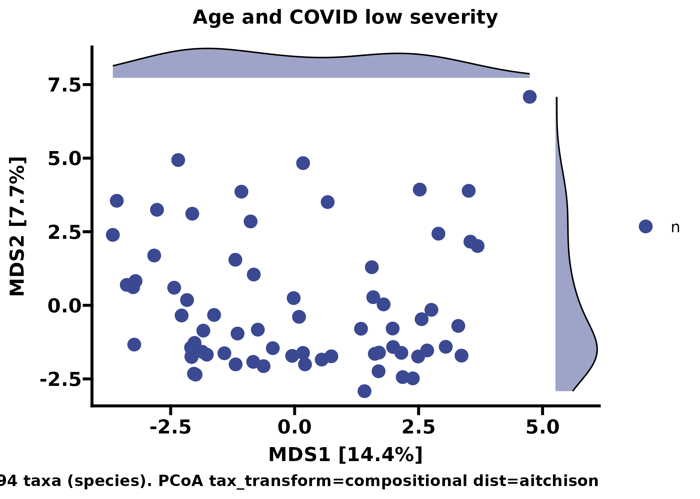

## Relative abundance plots (ol' faithful)

Super useful to make your own palette and assign to certain taxa, this helps your viewers understand trends in this data.

```{r, echo=FALSE, eval=FALSE}
# Make your custom color palette
myPal <- tax_palette(
  data = vid, rank = "genus", n = 25, pal = "greenArmytage",
  add = c(Other = "gray")
)
tax_palette_plot(myPal)

vid %>%
  comp_barplot(
    tax_level = "genus", n_taxa = 10,
    taxa_order = sum,
    sample_order = "bray", bar_outline_colour = NA,
  ) +
  facet_grid(
    rows = vars(Time, PHQ_Covid_Severity),
    scales = "free", space = "free" # these options are critically important!
  ) +
  coord_flip() +
  theme(axis.text.y = element_blank(), axis.ticks.y = element_blank())

ggsave("assets/img/relabund_genus.png", height = 5, width = 7, units = "in")
```

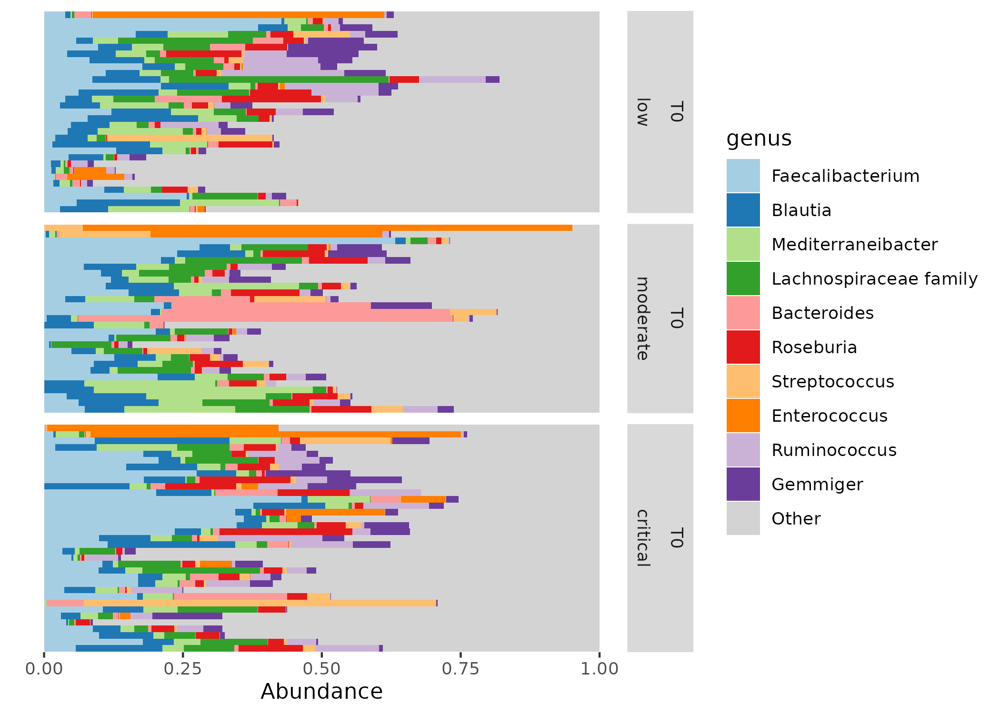

## Comparing the top microbes found in different severity states

Heatmap of abundance with severity states

```{r, eval = FALSE}
# Define the colors for PHQ_Covid_Severity levels
cols <- c("low" = "#FDB52D", "moderate" = "#6666FF", "critical" = "#FC6666")

# Create heatmap 
vid |>
  ps_seriate(rank = "species", tax_transform = "clr", dist = "euclidean") |>
  ps_arrange(PHQ_Covid_Severity) |>
  tax_transform("clr", rank = "species") |>
  tax_filter(min_prevalence = 75 / 100, verbose = FALSE, min_total_abundance = 100000) |>
  comp_heatmap(
    tax_anno = taxAnnotation(
      Prev. = anno_tax_prev(bar_width = 0.3, size = grid::unit(1, "cm"))
    ),
    sample_anno = sampleAnnotation(
      State1 = anno_sample_cat(var = "PHQ_Covid_Severity", col = cols),  # Annotate the severity levels
      border = FALSE
    ),
    sample_seriation = "Identity",  # Disable additional seriation to preserve the group order
    heatmap_legend_param = list(title = "CLR abundance")
  )

ggsave("assets/img/sev_htmp_species.png", height = 5, width = 7, units = "in")

# i just ran it in a separate r script and used the plots tab to save as a pdf
```

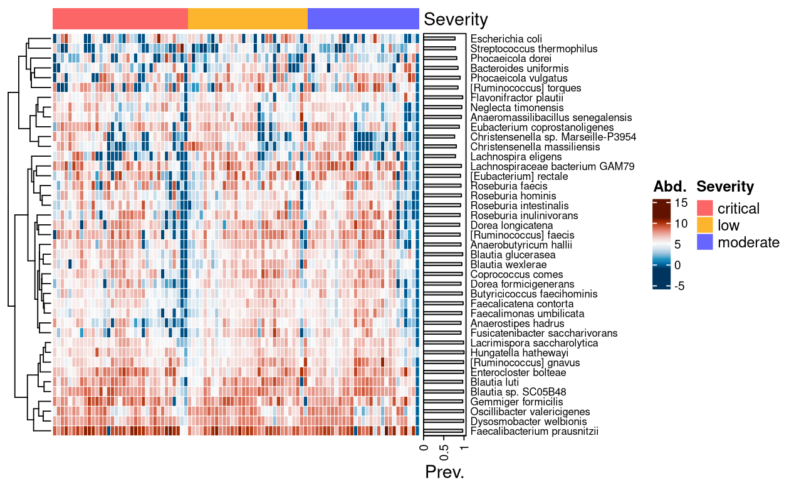

## Differential abudance analysis using ANCOMBC2

Differential abundance analysis for severity levels. I did cheat for these and write the outputs to a csv file and visualize them using prism but this is more than possible in R. I recommend using the ANCOMBC2 bioconductor [tutorial](https://www.bioconductor.org/packages/release/bioc/vignettes/ANCOMBC/inst/doc/ANCOMBC2.html) to do this if you so please.

```{r, eval = FALSE}
# round otu counts, we do this for our other analyses to keep consistent
round_covid = round(otu_table(physeq))

# Update sample_data in phyloseq object
bigvid <- phyloseq(round_covid, physeq@tax_table, physeq@sam_data)

# Subset to get rid of the None values for BMI
goodvid = subset_samples(bigvid, BMI == "Lean" | BMI == "Obese")

# Read in phyloseq for ancombc
tse <- mia::makeTreeSummarizedExperimentFromPhyloseq(goodvid)

# Subset to low, moderate, and critical severity subjects
tse = tse[, tse$PHQ_Covid_Severity %in% c("low", "moderate", "critical")]

# To manually change the reference level, for instance, setting `low`
# as the reference level, use:
tse$PHQ_Covid_Severity = factor(tse$PHQ_Covid_Severity, levels = c("low", "moderate", "critical"))

# set seed for ancombc
set.seed(123)

# run ancombc
output3 <- ancombc2(data = tse, assay_name = "counts", tax_level = "species",
                    fix_formula = "PHQ_Covid_Severity + BMI + Sex + Old", rand_formula = NULL,
                    p_adj_method = "holm", pseudo_sens = TRUE,
                    prv_cut = 0.1, lib_cut = 10000, s0_perc = 0.05,
                    group = "PHQ_Covid_Severity", struc_zero = TRUE, neg_lb = TRUE,
                    alpha = 0.05, n_cl = 2, verbose = TRUE,
                    global = TRUE, pairwise = TRUE, dunnet = TRUE, trend = TRUE,
                    iter_control = list(tol = 1e-2, max_iter = 20, 
                                        verbose = TRUE),
                    em_control = list(tol = 1e-5, max_iter = 100),
                    lme_control = lme4::lmerControl(),
                    mdfdr_control = list(fwer_ctrl_method = "holm", B = 100),
                    trend_control = list(contrast = list(matrix(c(1, 0, -1, 1),
                                                                nrow = 2, 
                                                                byrow = TRUE),
                                                         matrix(c(-1, 0, 1, -1),
                                                                nrow = 2, 
                                                                byrow = TRUE),
                                                         matrix(c(1, 0, 1, -1),
                                                                nrow = 2, 
                                                                byrow = TRUE)),
                                         node = list(2, 2, 1),
                                         solver = "ECOS",
                                         B = 100)); plan(multisession, workers = 12)
# How many structural zeroes?
tab_zero <- output3$zero_ind
tab_zero |>
  datatable(caption = "The detection of structural zeros")

#Print output to dataframe
res_prim3 <- output3$res

#Save ancombc stats for each subset
write.csv(res_prim3, file = "ancombc2_files/24_09_16_covid_sev_bmi_sex_old_group_severity_ancom.csv", row.names = FALSE)
```

Differential abundance analysis for mental health conditions

```{r, eval = FALSE, message=FALSE}
# round otu counts (should already be done)
round_covid = round(otu_table(physeq))

# Update sample_data in phyloseq object
bigvid <- phyloseq(round_covid, physeq@tax_table, physeq@sam_data)

# Read in phyloseq for ancombc
tse <- mia::makeTreeSummarizedExperimentFromPhyloseq(bigvid)

# Subset to lean, overweight, and obese subjects
tse = tse[, tse$PSS_state %in% c("n", "y")]

# To manually change the reference level, for instance, setting `obese`
# as the reference level, use:
tse$PSS_state = factor(tse$PSS_state, levels = c("n", "y"))

# set seed for ancombc
set.seed(123)

# run ancombc
output3 <- ancombc2(data = tse, assay_name = "counts", tax_level = "species",
                    fix_formula = "PHQ_15_state + PSS_state +Anxiety_state + Depress_state", rand_formula = NULL,
                    p_adj_method = "holm", pseudo_sens = TRUE,
                    prv_cut = 0.1, lib_cut = 10000, s0_perc = 0.05,
                    group = "Depress_state", struc_zero = TRUE, neg_lb = TRUE,
                    alpha = 0.05, n_cl = 2, verbose = TRUE,
                    global = TRUE, pairwise = TRUE, dunnet = TRUE, trend = TRUE,
                    iter_control = list(tol = 1e-2, max_iter = 20, 
                                        verbose = TRUE),
                    em_control = list(tol = 1e-5, max_iter = 100),
                    lme_control = lme4::lmerControl(),
                    mdfdr_control = list(fwer_ctrl_method = "holm", B = 100),
                    trend_control = list(contrast = list(matrix(c(1, 0, -1, 1),
                                                                nrow = 2, 
                                                                byrow = TRUE),
                                                         matrix(c(-1, 0, 1, -1),
                                                                nrow = 2, 
                                                                byrow = TRUE),
                                                         matrix(c(1, 0, 1, -1),
                                                                nrow = 2, 
                                                                byrow = TRUE)),
                                         node = list(2, 2, 1),
                                         solver = "ECOS",
                                         B = 100)); plan(multisession, workers = 12)
# How many structural zeroes?
tab_zero <- output3$zero_ind
tab_zero |>
  datatable(caption = "The detection of structural zeros")

#Print output to dataframe
res_prim3 <- output3$res

#Save ancombc stats for each subset
write.csv(res_prim3, file = "ancombc2_files/24_09_16_covid_allmental_group_depress_ancom.csv", row.names = FALSE)
```

## Mental health correlations to microbes 

```{r, eval=FALSE, message=FALSE}
vid_mental = ps_filter(vid, Somatization != "NA")

#View(sample_data(vid_mental))

desired_order <- c("Somatization", "Stress", "Anxiety", "Depression")

correlations_df <- vid_mental |>
  tax_model(
    trans = "clr",
    #taxa = tax_top(vid, 30, by = max, rank = "species"), #comment this out to see all with p < 0.05
    rank = "species", 
    variables = list("Somatization", "Stress", "Anxiety", "Depression"),
    type = microViz::cor_test, method = "spearman", 
    use_future = TRUE,
    return_psx = FALSE, verbose = FALSE
  ) |>
  tax_models2stats(rank = "species")

# get nice looking ordering of correlation estimates using hclust
taxa_hclust <- correlations_df |>
  dplyr::select(term, taxon, estimate) |> 
  tidyr::pivot_wider(
    id_cols = taxon, names_from = term, values_from = estimate
  ) |>
  tibble::column_to_rownames("taxon") |> 
  as.matrix() |>
  stats::dist(method = "euclidean") |> 
  hclust(method = "ward.D2") 

taxa_order <- taxa_hclust$labels[taxa_hclust$order]

correlations_df |>
  mutate(
    p.FDR = p.adjust(p.value, method = "fdr"),
    taxon = factor(taxon, levels = taxa_order),
    term = factor(term, levels = desired_order)
  ) |>
  ggplot(aes(x = term, y = taxon)) +
  geom_tile(aes(fill = estimate), color = "white", size = 0.5) +
  geom_point(
    data = function(x) filter(x, p.value < 0.05),
    shape = "asterisk", size = 3
  ) +
  geom_point(
    data = function(x) filter(x, p.FDR < 0.05),
    shape = "circle", size = 4, stroke = 1.5
  ) +
  scale_y_discrete(limits = taxa_order, expand = c(0, 0)) +
  scale_x_discrete(limits = desired_order, expand = c(0, 0)) +
  scale_fill_distiller(palette = "RdBu", limits = c(-0.45, 0.45)) + 
  theme_minimal(base_size = 12) + 
  theme(
    axis.text.x = element_text(angle = 45, hjust = 1, vjust = 1),
    axis.text.y = element_text(size = 8),
    panel.grid = element_blank(),
    panel.border = element_rect(fill = NA, color = "black", linewidth = 0.25),
    legend.position = "right",
    plot.margin = margin(10, 10, 10, 10)
  ) +
  labs(
    x = NULL, y = NULL, fill = "\nSpearman's\nRank\nCorrelation",
    caption = paste(
      "Asterisk indicates p < 0.05, not FDR adjusted",
      "Filled circle indicates FDR corrected p < 0.05", sep = "\n"
    )
  )

#ggsave("assets/img/vid_mental_microbe_corr_w_sig.png", height = 14, width = 12, units = "in")

```


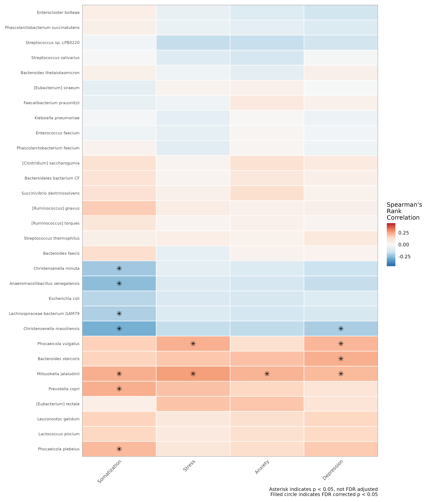


## Redundancy analysis (RDA) for mental health connections

```{r, eval=FALSE, layout="l-body-outset", fig.width=6, fig.height=5}

# using the correlations that have p < 0.05 from the mental health subjects
mental_correls = correlations_df |>
  filter(p.value < 0.05)

vid_mental = ps_filter(vid, Somatization != "NA")

sig_mental_microbes = subset_taxa(vid_mental, species %in% mental_correls$taxon) |>
  tax_filter(min_prevalence = 5 / 100, verbose = FALSE, min_total_abundance = 5000)

# First, define your custom color palette
sig_mental_microbes |>
  ps_mutate(
    Somatization = Somatization,
    Stress = Stress,
    Anxiety = Anxiety,
    Depression = Depression
  ) |>
  tax_transform("clr", rank = "species") |>
  ord_calc(
    constraints = c("Somatization", "Stress", "Anxiety", "Depression"),
    scale_cc = FALSE # doesn't make a difference
  ) |>
  ord_plot(
    colour = "PHQ_Covid_Severity", size = 3, alpha = 1,
    plot_taxa = tax_top(vid, 30, by = max, rank = "species"),
  ) +
  scale_color_manual(
    values = c(
      "low" = "#FDB52D",
      "moderate" = "#6666FF",
      "critical" = "#FC6666"
    ),
    name = "PHQ_Covid_Severity"
  ) +
  scale_fill_manual(
    values = c(
      "low" = "#FDB52D",
      "moderate" = "#6666FF",
      "critical" = "#FC6666"
    ),
    name = "PHQ_Covid_Severity"
  ) +
  theme_prism() +
  # if you want to name your samples you can use this
  # geom_text_repel(aes(label = sample_names(sig_mental_microbes)), 
  #                 size = 3, 
  #                 max.overlaps = Inf,
  #                 box.padding = 0.5,
  #                 point.padding = 0.1,
  #                 segment.color = "grey50") +
  ggtitle("Mental health and Covid Severity") +
  ggside::geom_xsidedensity(aes(fill = PHQ_Covid_Severity), alpha = 0.5, show.legend = FALSE) +
  ggside::geom_ysidedensity(aes(fill = PHQ_Covid_Severity), alpha = 0.5, show.legend = FALSE) +
  ggside::theme_ggside_void() +
  theme(
    axis.title.x = element_text(size = 14),
    axis.title.y = element_text(size = 14),
    axis.text.x = element_text(size = 14),
    axis.text.y = element_text(size = 14),
    plot.title = element_text(size = 14)
  )

ggsave("assets/img/covid_mental_rda_phq.png", height = 5, width = 7, units = "in")

```

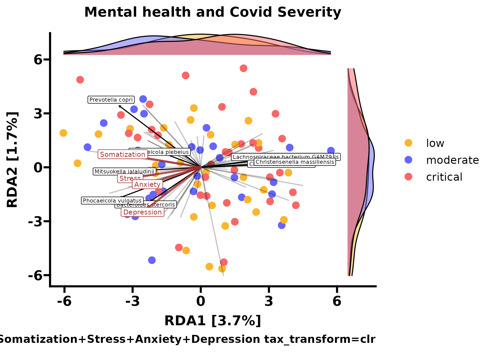


## Microbial network interactions with Spiec-Easi

This step can be very computationally intensive if performed on a large dataset like this. To run this, I subset my phyloseq object __vid__ to only include the microbes that were with the mental health spearmans correlations where p < 0.05

I wrote a command line script to do this and ran it in a tmux terminal. Here is my file I used if you are interested, please adjust the ```ncores``` value accordingly.

```{r, eval = FALSE}
vid_mental = ps_filter(vid, Somatization != "NA")

# using the correlations that have p < 0.05 from the mental health subjects
mental_correls = correlations_df |>
  filter(p.value < 0.05)

sig_mental_microbes = subset_taxa(vid_mental, species %in% mental_correls$taxon) |>
  tax_filter(min_prevalence = 5 / 100, verbose = FALSE, min_total_abundance = 5000)

saveRDS(sig_mental_microbes, file = "network_files/sig_mental_microbes.rds")
```

And the R executable script
__spiec_CLI.R__

```{r, eval = FALSE}
#!/usr/bin/env Rscript

library(phyloseq)
library(SpiecEasi)

# Function to perform Spiec-Easi network analysis
run_spiec_easi <- function(physeq) {
  # Run Spiec-Easi directly on the phyloseq object
  pargs2 <- list(rep.num=50, seed=10010, ncores=72)
  t2 <- system.time(
    se2 <- spiec.easi(physeq, method='mb', lambda.min.ratio=1e-3, nlambda=30,
                      sel.criterion='stars', pulsar.select=TRUE, pulsar.params=pargs2)
  )
  
  # Return the Spiec-Easi object
  return(se2)
}

# Main script
args <- commandArgs(trailingOnly = TRUE)

# Check if the input file is provided
if (length(args) == 0) {
  stop("No input file provided. Please provide the path to a phyloseq object RDS file.")
}

# Load the phyloseq object from the provided RDS file
physeq_file <- args[1]
physeq <- readRDS(physeq_file)

# Perform Spiec-Easi analysis
spiec_easi_res <- run_spiec_easi(physeq)

# Save the result
output_file <- sub("\\.rds$", "_spiec_easi_mb_result.rds", physeq_file)
saveRDS(spiec_easi_res, file = output_file)

cat("Spiec-Easi network analysis complete. Results saved to", output_file, "\n")

```

I used this R code to visualize the .rds file computed from the executable R file.

```{r, eval = FALSE}
se_mental = readRDS("network_files/sig_mental_microbes_spiec_easi_result.rds")

otu_spec_map = read.csv("covid_otu_map.csv") |>
  select(OTU, species)

# Convert the species_mapping dataframe to a named vector for easy lookup
otu_to_species <- setNames(as.character(otu_spec_map$species), otu_spec_map$OTU)

ig2.mb <- adj2igraph(getRefit(se_mental),  vertex.attr=list(name=taxa_names(sig_mental_microbes)))
V(ig2.mb)$name <- otu_to_species[V(ig2.mb)$name]
plot_network(ig2.mb, sig_mental_microbes, type='taxa', color="species")

# ferda mental health --> i was lazy and recolored this using coreldraw to match existing
node_low <- "#813C05"
ig2.mb <- adj2igraph(getRefit(se_mental),  vertex.attr=list(name=taxa_names(sig_mental_microbes)))
V(ig2.mb)$name <- otu_to_species[V(ig2.mb)$name]
V(ig2.mb)$color <- node_low
plot(ig2.mb, vertex.color = V(ig2.mb)$color,
     vertex.label.color = "black", vertex.size=4, main = "Mental health microbial network")

ggsave(filename = "asset/img/spearman_mental_microbe_net.png", units = "in", height = 10, width = 12)

```

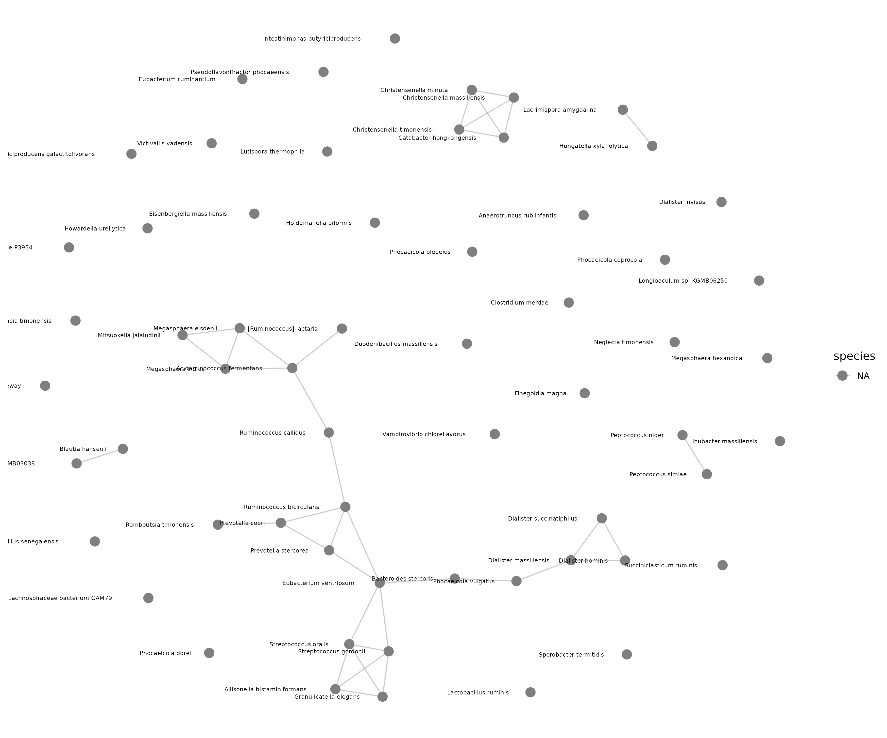


## Bakdrive analysis 

One last interesting comparisom that we performed between the severity level was with [Bakdrive](https://academic.oup.com/bioinformatics/article/39/Supplement_1/i47/7210449). Bakdrive is a project that I am currently trying to improve upon and we use it here to characterize the differences in driver species between the Covid-19 severity groups.

Bakdrive is quite computationally intensive currently, so we took ten randomly selected samples from each severity level and ran this through our HPC. Also, using the gurobi solver was shown to reduce compute time on the ILPs/QPs so if you run into issues with run times I'd give that a shot.

To create the Bakdrive input files I used this code below. It will select 10 random samples from each severity group.

```{r, eval=FALSE}
# subset the phyloseq object based on severity 
vid_low = ps_filter(vid, PHQ_Covid_Severity == "low")
vid_mod = ps_filter(vid, PHQ_Covid_Severity == "moderate")
vid_crit = ps_filter(vid, PHQ_Covid_Severity == "critical")

# Set a seed
set.seed(42)
# Get the sample names from the phyloseq object
low_sample_names <- sample_names(vid_low)
# Randomly select 5 sample names
low_subset_samples <- sample(low_sample_names, 10)
# Subset the phyloseq object to these 5 samples
low_subset <- prune_samples(low_subset_samples, vid_low)

# Set a seed
set.seed(42)
# Get the sample names from the phyloseq object
mod_sample_names <- sample_names(vid_mod)
# Randomly select 5 sample names
mod_subset_samples <- sample(mod_sample_names, 10)
# Subset the phyloseq object to these 5 samples
mod_subset <- prune_samples(mod_subset_samples, vid_mod)

# Set a seed
set.seed(42)
# Get the sample names from the phyloseq object
crit_sample_names <- sample_names(vid_crit)
# Randomly select 5 sample names
crit_subset_samples <- sample(crit_sample_names, 10)
# Subset the phyloseq object to these 5 samples
crit_subset <- prune_samples(crit_subset_samples, vid_crit)
```

Data prep for bakdrive input abundance files

```{r, eval=FALSE}
# Function to convert abundance to percentage
abundance_to_percentage <- function(x) {
  return(x / sum(x) * 100)
}

# Function to extract species name
extract_species_name <- function(genus, species) {
  if (is.na(species) || species == "") {
    return(paste0("[", genus, "]"))
  } else if (grepl(genus, species)) {
    return(species)
  } else {
    return(paste(genus, species))
  }
}

# Main function to convert phyloseq object to txt files
convert_phyloseq_to_txt <- function(physeq_obj, output_dir = "output_files") {
  # Create output directory if it doesn't exist
  dir.create(output_dir, showWarnings = FALSE)
  
  # Extract OTU table and taxonomy
  otu_table <- as(otu_table(physeq_obj), "matrix")
  tax_table <- as(tax_table(physeq_obj), "matrix")
  
  # Extract species names
  species_names <- mapply(extract_species_name, tax_table[, "genus"], tax_table[, "species"])
  rownames(otu_table) <- species_names
  
  # Process each sample
  for (sample in colnames(otu_table)) {
    # Extract sample data
    sample_data <- otu_table[, sample]
    
    # Remove zero counts
    sample_data <- sample_data[sample_data > 0]
    
    # Calculate percentages
    percentages <- abundance_to_percentage(sample_data)
    
    # Create data frame
    output_df <- data.frame(
      Species = names(sample_data),
      Percentage = round(percentages, 2),
      Abundance = sample_data
    )
    
    # Sort by percentage (descending)
    output_df <- output_df[order(-output_df$Percentage), ]
    
    # Write to file without headers
    output_file <- file.path(output_dir, paste0(sample, ".txt"))
    write.table(output_df, file = output_file, sep = "\t", quote = FALSE, row.names = FALSE, col.names = FALSE)
  }
  
  cat("Conversion complete. Files saved in", output_dir, "\n")
}

# Usage example (uncomment and modify as needed):
convert_phyloseq_to_txt(low_subset)

```

After we made the directory containing our abundance files, I ran this in the command line to make our inputs for Bakdrive.

```
find /path/to/directory -type f -print > file_list.txt
```

See the documentation on [figure layout](figures.html) for details on additional layout options.

The examples above are based on conventional R plots. Distill articles can also incorporate [diagrams](diagrams.html) and [interactive visualizations](interactivity.html) based on JavaScript and D3.


